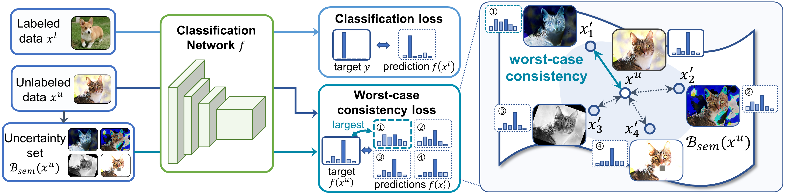

## MaxMatch: Semi-Supervised Learning with Worst-Case Consistency

This is a PyTorch implementation of [MaxMatch](https://arxiv.org/abs/2209.12611) for the ImageNet-1k dataset. The model is instantiated on [FixMatch](https://arxiv.org/abs/2001.07685) and the code is based on [EMAN](https://github.com/amazon-science/exponential-moving-average-normalization). We sincerely thank the authors for their work.




### Environments

* torch>=1.5.0
* torchvision>=0.6.0
* pandas
* faiss-gpu


### Data Preparation

Install ImageNet dataset following the [official PyTorch ImageNet training code](https://github.com/pytorch/examples/tree/master/imagenet), with the standard data folder structure for the torchvision ``datasets.ImageFolder``. Unzip the semi-supervised index file ``indexes.zip`` and move it to the ImageNet data folder. The file structure should look like:

  ```bash
  $ tree data
  imagenet
  ├── train
  │   ├── class1
  │   │   └── *.jpeg
  │   ├── class2
  │   │   └── *.jpeg
  │   └── ...
  ├── val
  │   ├── class1
  │   │   └── *.jpeg
  │   ├── class2
  │   │   └── *.jpeg
  │   └── ...
  └── indexes
      └── *_index.csv
  ```

### Training

#### Self-supervised Pre-training
MoCo-v2 for 200 epochs:
```
python main_moco.py \
  --arch MoCo --backbone resnet50_encoder \
  --epochs 200 --warmup-epoch 10 \
  --moco-t 0.2 --cos \
  --dist-url 'tcp://localhost:10001' --multiprocessing-distributed --world-size 1 --rank 0 \
  /path/to/imagenet
```

#### Semi-supervised Training
MaxMatch (the parameter ``K`` controls the number of strong augmented variants):
```
python main_maxmatch.py \
  --arch MaxMatch --backbone resnet50_encoder \
  --lr 0.02 --K 3 \
  --epochs 300 --cos \
  --warmup-epoch 5 \
  --modeldir checkpt/maxmatch \
  --trainindex_x train_10p_index.csv --trainindex_u train_90p_index.csv \
  --dist-url 'tcp://localhost:10001' --multiprocessing-distributed --world-size 1 --rank 0 \
  /path/to/imagenet
```

FixMatch:
```
python main_fixmatch.py \
  --arch FixMatch --backbone resnet50_encoder \
  --lr 0.03 \
  --epochs 300 --cos \
  --warmup-epoch 5 \
  --modeldir checkpt/fixmatch \
  --trainindex_x train_10p_index.csv --trainindex_u train_90p_index.csv \
  --dist-url 'tcp://localhost:10001' --multiprocessing-distributed --world-size 1 --rank 0 \
  /path/to/imagenet
```

Other options:
* ``--eman``: use EMAN
* ``--self-pretrained checkpt/moco/model_best.pth.tar``: use self-pretrained models
* ``--resume checkpt/maxmatch/ckpt-x.pth.tar``: resume from checkpoints

#### Linear Classification and Finetuning

With a pre-trained model, to train a supervised linear classifier on frozen features/weights (e.g. MoCo) on 10% imagenet, run:
```
python main_lincls.py \
  -a resnet50 \
  --lr 30.0 \
  --epochs 50 --schedule 30 40 \
  --eval-freq 5 \
  --trainindex train_10p_index.csv \
  --model-prefix encoder_q \
  --pretrained /path/to/model_best.pth.tar \
  --dist-url 'tcp://localhost:10001' --multiprocessing-distributed --world-size 1 --rank 0 \
  /path/to/imagenet
```

To finetune the self-supervised pretrained model on 10% imagenet, with different learning rates for pretrained backbone and last classification layer, run:
```
python main_cls.py \
  -a resnet50 \
  --lr 0.001 --lr-classifier 0.1 \
  --epochs 50 --schedule 30 40 \
  --eval-freq 5 \
  --trainindex train_10p_index.csv \
  --model-prefix encoder_q \
  --self-pretrained /path/to/model_best.pth.tar \
  --dist-url 'tcp://localhost:10001' --multiprocessing-distributed --world-size 1 --rank 0 \
  /path/to/imagenet
```


### Citation

If you use the code of this repository, please cite our paper:
```
@ARTICLE{jiang22maxmatch,
  author={Jiang, Yangbangyan and Li, Xiaodan and Chen, Yuefeng and He, Yuan and Xu, Qianqian and Yang, Zhiyong and Cao, Xiaochun and Huang, Qingming},
  journal={IEEE Transactions on Pattern Analysis and Machine Intelligence},
  title={MaxMatch: Semi-Supervised Learning With Worst-Case Consistency},
  year={2022}
}
```


### License

This project is under the CC-BY-NC 4.0 license. See [LICENSE](LICENSE) for details.
